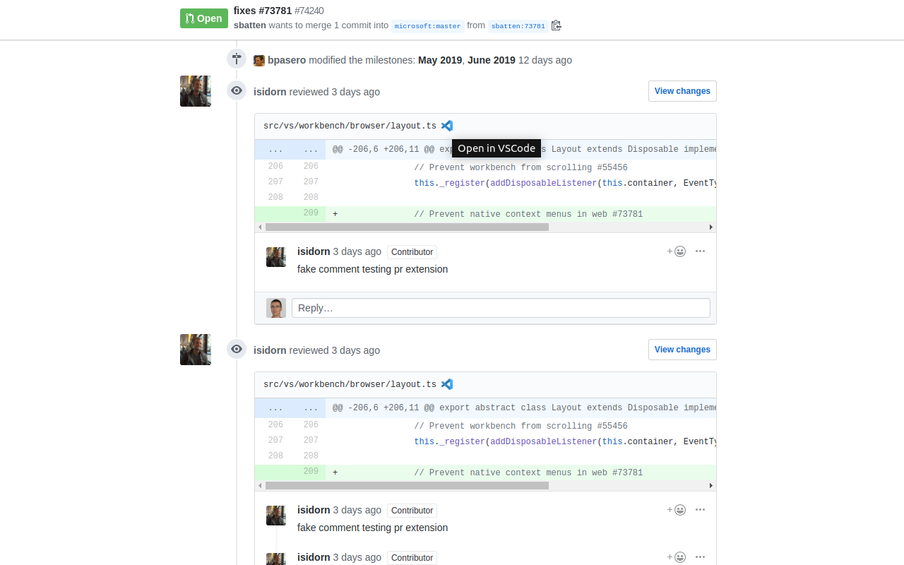

# Chrome extension to open GitHub file links in your IDE

This browser extension allows GitHub users to open files in your IDE directly from GitHub.

## Supported IDEs:

* VSCode
* VSCode Insiders
* PhpStorm (coming soon...)
* WebStorm (coming soon...)

## New features & bugs

Need a feature? Want to report a bug? Feel free to open an issue or a pull request!

## Changelog

### Version 1.0.1 - June 14, 2019

* Add VSCode Insiders support
* Add CSS theme for options page
* Open options page automatically after install

### Version 1.0.0 - June 6, 2019

* First release!
* Add VSCode support
