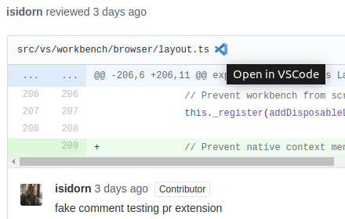

# Chrome extension to open GitHub file links in your IDE

This browser extension allows you to open files in your IDE directly from GitHub with the cursor at the desired line when possible.

	

## Supported IDEs:

* VSCode
* VSCode Insiders
* PhpStorm
* WebStorm (not tested yet)

PhpStorm support is native on MacOS, but on Linux and Windows you need to install an url handler:

* Linux: https://github.com/sanduhrs/phpstorm-url-handler
* Windows: https://github.com/aik099/PhpStormProtocol

I have not tested WebStorm support yet, feedbacks are welcome!

## New features & bugs

Need a feature? Want to report a bug? Feel free to open an issue or a pull request!

## Changelog

### Version 1.0.3 - June 15, 2019

* Add PhpStorm support

### Version 1.0.2 - June 14, 2019

* Add missing VSCode Insiders icon

### Version 1.0.1 - June 14, 2019

* Add VSCode Insiders support
* Add CSS theme for options page
* Open options page automatically after install

### Version 1.0.0 - June 6, 2019

* First release!
* Add VSCode support
