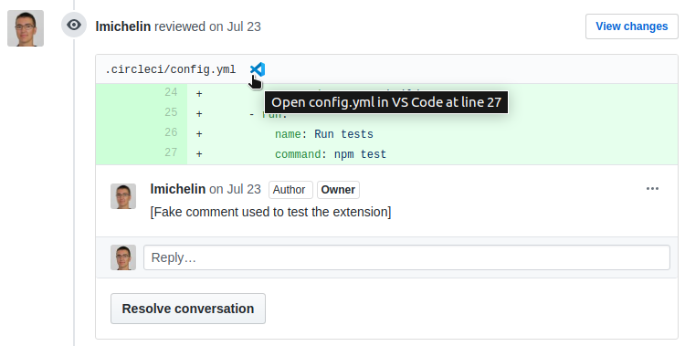

# Browser extension to open GitHub file links in your IDE

This browser extension allows you to open files in your IDE directly from GitHub, assuming the repository you are working on is cloned on your computer. When a fragment of a file is displayed, your IDE opens the file and puts the cursor at the desired line.

👉 Google Chrome: https://chrome.google.com/webstore/detail/open-github-gitlab-in-ide/bmifnnfmccmleigpaolofacllndmfned

👉 Firefox: https://addons.mozilla.org/firefox/addon/open-github-gitlab-in-ide/

	

## Getting started

Once the extension is installed:

- Click on the extension icon to open the settings popup
- Set the local path where GitHub repositories are cloned on your computer
- Select the IDE you want to use to open GitHub links
- Reload GitHub and start using the extension

## Supported IDEs:

- VS Code
- VSCodium
- VS Code Insiders
- PhpStorm
- IntelliJ IDEA
- Any JetBrains editor (using built-in web server)
- WebStorm (not tested yet)
- GoLand
- CLion

WSL with the Ubuntu distribution is also supported on VS Code, VSCodium and VS Code Insiders for Windows.

PhpStorm & IntelliJ IDEA support is native on MacOS, but on Linux and Windows you need to install an url handler (see [this answer](https://stackoverflow.com/a/56066943/104891)):

- Linux: https://github.com/sanduhrs/phpstorm-url-handler
- Windows: https://github.com/aik099/PhpStormProtocol

I have not tested WebStorm support yet, feedbacks are welcome!

You can also use the built-in web server of any JetBrains editor (IDEA, WebStorm, PhpStorm, WebStorm, ...) instead of the url handler. For that you need to install the PHP plugin. See [here](https://www.jetbrains.com/help/idea/php-built-in-web-server.html) for more information. The built-in web server must be started on port 63342.

> To disable JetBrains warning "_'file' API is requested. Do you trust unknown host?_", you can go to `File > Settings > Build, Execution, Deployment > Debugger` and Check the _Allow unsigned requests_ in the _Built-in Server_ section.

## New features & bugs

Need a feature? Want to report a bug? Feel free to open an issue or a pull request!

## Contributing

- Clone the project
- Run `yarn` to install the dependencies
- Run `yarn dev` to start the development server
- On Google Chrome:
  - Open [chrome://extensions/](chrome://extensions/)
  - Enable developer mode
  - Click on `Load unpacked`
  - Select the `dist/chrome` folder
- On Firefox:
  - Open [about:debugging#/runtime/this-firefox](about:debugging#/runtime/this-firefox)
  - Click on `Load Temporary Add-on`
  - Select the `dist/firefox/manifest.json` file
- The extension and the pages using it will be automatically reloaded when you modify the source code

## Credits

ALl the credits to @lmichelin for the original extension. I just forked it and added support for Gitlab.

## Changelog

### Version 1.2.2 - November 28,2022

- Add support for CLion ([#39](https://github.com/lmichelin/open-github-links-in-ide/pull/39))

### Version 1.2.1 - August 18,2022

- Add support for GoLand ([#32](https://github.com/lmichelin/open-github-links-in-ide/pull/32))

### Version 1.2.0 - August 11,2022

- Add support for VS Code + WSL (Ubuntu) on Windows
- Migrate to manifest V3 on Chrome
- Fix bug: icon was not showing in file tree after an update on GitHub side
- Fix bug: icon was not showing in the "files changed" tab after clicking on it, a page reload was required ([#35](https://github.com/lmichelin/open-github-links-in-ide/issues/35))

### Version 1.1.14 - June 8, 2022

- Fix bug: icon was not showing in discussions after an update on GitHub side

### Version 1.1.13 - November 22, 2021

- Fix bug: extension was crashing on pull requests containing resolved conversations

### Version 1.1.12 - October 4, 2021

- Fix bug: icon was not showing on line numbers after an update on GitHub side

### Version 1.1.11 - April 18, 2021

- Add permission required on Firefox to use JetBrains built-in web server ([#20](https://github.com/lmichelin/open-github-links-in-ide/pull/20))

### Version 1.1.10 - April 5, 2021

- Fix an issue with JetBrains editors ([#17](https://github.com/lmichelin/open-github-links-in-ide/issues/17))

### Version 1.1.9 - March 20, 2021

- Update VSCodium icon

### Version 1.1.8 - March 14, 2021

- Fix bug: all line numbers were hidden when cursor was over a "Suggested changes" section in the "files changed" tab

### Version 1.1.7 - March 7, 2021

- Fix file header selector
- Show editor icon on file block lines in conversation tab
- Add support for JetBrains editors using built-in web server ([#16](https://github.com/lmichelin/open-github-links-in-ide/pull/16))

### Version 1.1.6 - September 27, 2020

- Add support for VSCodium ([#11](https://github.com/lmichelin/open-github-links-in-ide/pull/11))

### Version 1.1.5 - June 29, 2020

- Make extension compatible with new GitHub design

### Version 1.1.4 - October 23, 2019

- Add IntelliJ IDEA support

### Version 1.1.3 - July 21, 2019

- Add Firefox support 🎉
- Set the extension icon according to the selected IDE

### Version 1.1.2 - July 1, 2019

- Fix blurry icons on Retina screens

### Version 1.1.1 - June 20, 2019

- Use popup instead of options page

### Version 1.1.0 - June 16, 2019

- Show editor icon instead of line number when hovering over a line in file blocks
- Add options to select where to show the icon in GitHub
- Add option to show debug messages in console
- Fix some bugs

### Version 1.0.3 - June 15, 2019

- Add PhpStorm support

### Version 1.0.2 - June 14, 2019

- Add missing VS Code Insiders icon

### Version 1.0.1 - June 14, 2019

- Add VS Code Insiders support
- Add CSS theme for options page
- Open options page automatically after install

### Version 1.0.0 - June 6, 2019

- First release!
- Add VS Code support
